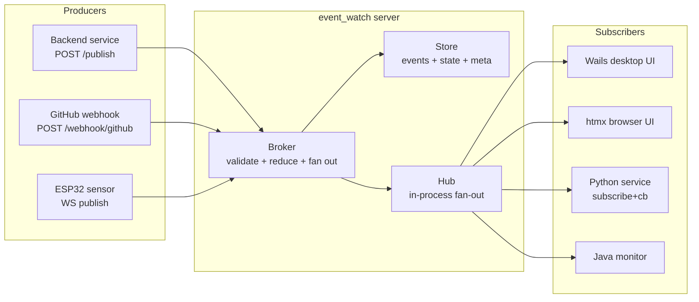

# event_watch — documentation

**event_watch** is a low-latency pub/sub notification service. Backend
services publish state changes (a PR opened, a build step finished, a counter
incremented, an ESP32 sensor reading); UI clients subscribe over WebSocket
and receive events in real time. Every topic also has a server-maintained
**computed state** (a "deep state" snapshot produced by folding events through
a reducer), so a fresh subscriber can start with the current value and stream
updates from there.

The design goal is: **make it easy for many observers to watch a shared
"thing" without polling, and let the server compute the "current shape" of
that thing so every observer sees a consistent view.**

## Read in this order

1. **[overview](#what-is-it-really)** below — 60-second mental model
2. **[architecture.md](architecture.md)** — components, ingest path, fan-out, mermaid diagrams
3. **[wire-protocol.md](wire-protocol.md)** — WS frames + HTTP endpoints (the ground truth for building a client)
4. **[object-types.md](object-types.md)** — the 8 built-in object types with lifecycle diagrams
5. **[build.md](build.md)** — install / run / test / configure
6. **[clients.md](clients.md)** — usage guides for Go, Python, Java, Rust, browser JS, ESP-IDF, Arduino
7. **[react-app.md](react-app.md)** — React + TypeScript demo app; deep vs shallow (CDC) UI integration patterns
8. **[demo-widgets.md](demo-widgets.md)** — hands-on: exact event types + payloads to drive both demo widgets, copy-paste demo scripts
9. **[kubernetes.md](kubernetes.md)** — container image + Kustomize manifests (server + Redis + ingress + Prometheus)
10. **[extending.md](extending.md)** — add your own reducer or webhook plugin

## What is it, really?

Two ideas layered together:

**1. Event streams per topic.** Every "thing" is a topic like
`pr/octocat/hello/42` or `int/hits/homepage`. Producers publish events onto
that topic (`pr_opened`, `int_incr`, etc.). Every event is stored, assigned a
monotonic sequence number, and fanned out to subscribers.

**2. Reduced state per topic.** Each object type registers a *reducer*: a
pure function `(state, event) → state` that folds the event stream into a
snapshot. When a subscriber connects, they can also ask "what's the current
value?" and get the reduced snapshot in one call — no need to replay
history.

Together they let you use the same system for two different shapes of data:
- **Object lifecycles** — a PR, a build, a deployment — where events are the
  raw changes and the state is a rich struct representing "how it is now"
- **Scalar fields** — a counter, a string, a timestamp — where mutations
  (Set/Incr/Decr) are events and the reduced state is the current value

## System at a glance

## Capability summary

| Capability | Notes |
|---|---|
| WebSocket subscribe + live event delivery | sub-millisecond fan-out on-node; every event frame carries the post-reduce state so `subscribe` alone is enough for "current value + all future changes" |
| HTTP publish + long/short-poll fallback | for clients that can't hold a WS |
| Refcounted client-side dispatch | N callbacks on one topic share one upstream subscription |
| Auto-reconnect with per-topic resume seq | client re-subscribes with `from_seq=lastSeen+1`, so no gap unless server has already trimmed |
| Pluggable storage | in-memory (zero-dep, tests) or Redis (Streams + Hashes + Set) |
| Pluggable auth | off by default; bearer token via flag; interface lets you plug JWT/OIDC later without touching transport |
| Webhook plugins | GitHub PR/review/comment/check_run ships in v1; adding a new provider is one file + one line |
| Metrics | Prometheus + JSON snapshot for the UI |
| TTL / archiver | per-topic TTL, background sweeper deletes aged topics |
| Six client libraries | Go, Python, Java, Rust, ESP-IDF, Arduino — same wire protocol |

## Object types shipped in v1

Two flavors, eight types:

**Event-object types** (rich state):

- `pr/<owner>/<repo>/<num>` — GitHub pull request lifecycle
- `build/<pipeline>/<run>` — CI build with per-step timings
- `deploy/<env>/<service>` — deployment with versions + health
- `job/<uuid>` — long-running job with progress + log tail
- `chat/<room>` — chat room with participants + recent messages

**Scalar-field types** (current value):

- `str/<name>` — string field: `set` / `delete`
- `int/<name>` — integer field: `set` / `incr` / `decr` / `delete`
- `time/<name>` — time field: `set` / `now` / `add` / `delete`

Field arithmetic is atomic — the broker serialises ingest, so 500 concurrent
`int_incr(+1)` calls produce exactly `value=500`.

## Non-goals for v1

- Multi-node clustering (the Store interface has `Notify`/`Watch` stubs, no code paths call them yet — single-node only)
- Wildcard subscriptions (`pr/octo/*`) — straightforward add later
- Cold-storage archive to S3/disk — v1 either purges or moves to a Redis archive namespace
