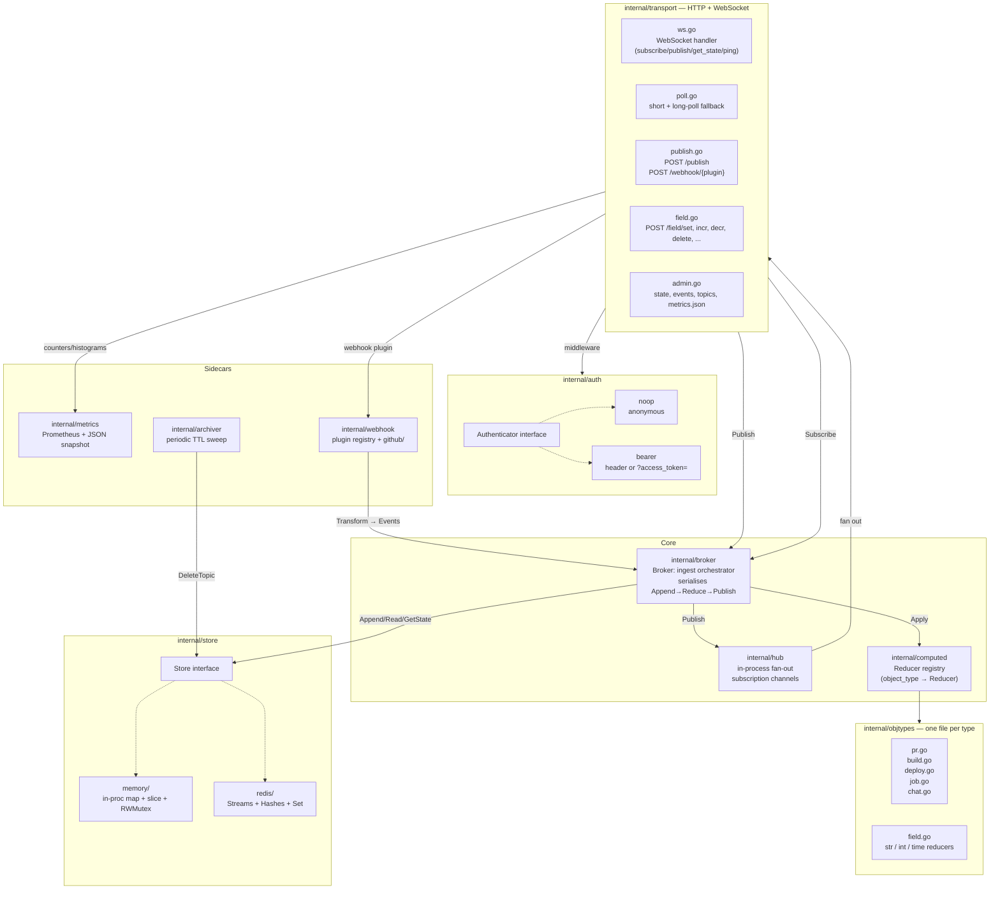
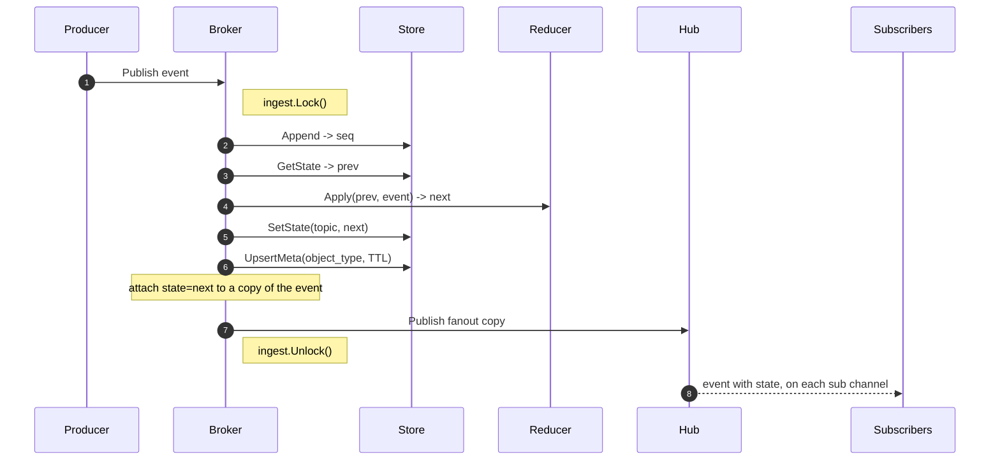
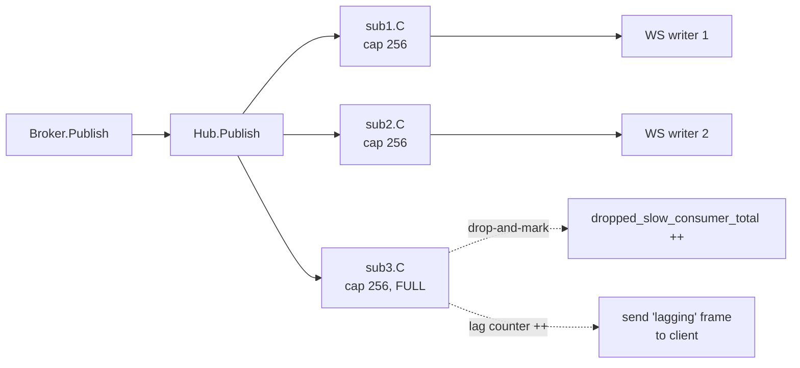
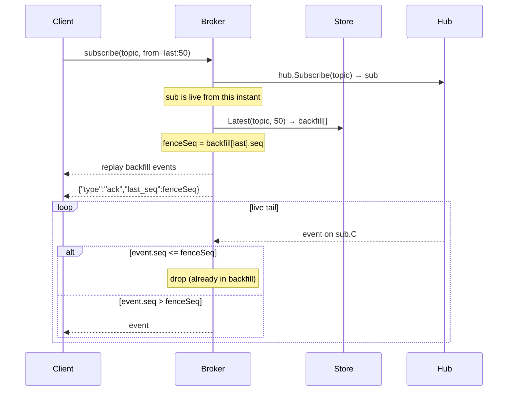
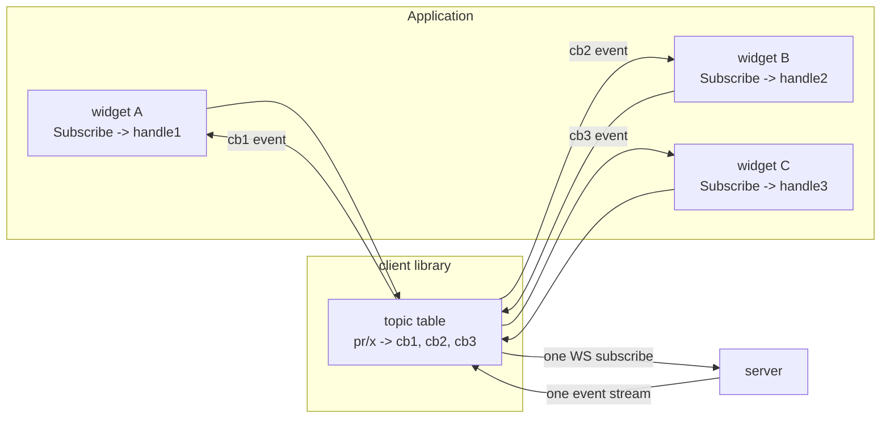
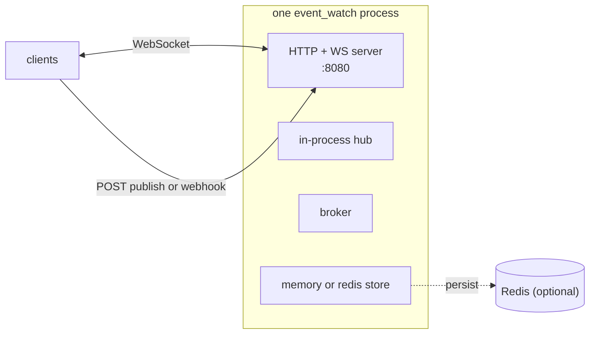
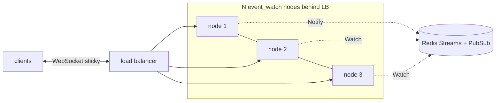

# Architecture

## Component map



## Ingest path — single-topic ordering under concurrent publishers

Every publish (from HTTP, WS, or a webhook) hits `Broker.Publish`, which
grabs a **process-wide mutex** for the duration of one event. This is the
guarantee that makes `int_incr` atomic: no interleaving between `read state
→ apply reducer → write state`.



Design choices worth calling out:

- **Store.Append happens before reduce.** The persisted event never carries the reduced state — state is a *derived cache*, and historical reads (`Read`, `Latest`) return raw events. This keeps the stream canonical and lets you evolve reducers without rewriting history.
- **The fanned-out event is a copy** (`fanout := *e`) with `State` set. Subscribers get event + current-state in one frame; the persisted event doesn't.
- **A single ingest mutex** is fine at v1 scale. If you need higher throughput for cross-topic parallelism, shard by `hash(topic) % N` — the Broker exposes a pluggable hook for this.

## Fan-out — one hub, per-sub buffered channels, drop-and-mark



- Buffered per-subscriber channels (default 256).
- Non-blocking `select` — a slow consumer never blocks the publisher; instead the event is dropped, `sub.Lag()` increments, and a `{"type":"lagging","missed":N}` frame is delivered so the client can decide to refetch via `GetState`.
- Close is race-safe: the channel is *never* closed; instead a `done` chan is closed and publishers include a `<-done` arm in their non-blocking select.

## Subscribe backfill — seed + fence-based dedup

When you subscribe with `from=last:50` or `from_seq=X`, the server needs to
avoid duplicating events between the historical replay and the live tail.



The subscription is created **before** the backfill fetch, so no live event
is missed. The `fenceSeq` is used to dedupe against events that raced in
between.

## Client-side refcount dispatch

Every language client (except the MCU ones) implements the same idea: N
callbacks on one topic share one upstream WS subscription. Only when the
last handle closes does the client send `unsubscribe` upstream.



When `handle2.Close()` runs, the client removes `cb2`; the WS subscription
stays because `[cb1, cb3]` is still non-empty. When the last handle closes,
the client sends `{"op":"unsubscribe","topic":"pr/x"}`.

## Package structure (server side)

```
event_watch/
  cmd/
    server/                # cmd/server/main.go — flags → server.Run
    testclient/            # scriptable CLI harness
  internal/
    core/                  # Event, TopicMeta, Topic parse, SubscribeOpts
    store/
      store.go             # interface + ErrNotFound
      memory/store.go      # in-proc impl (map + slice + RWMutex)
      redis/store.go       # Redis impl (Streams + Hashes + Sets + INCR)
    hub/                   # subscriber registry + non-blocking fan-out
    computed/              # Reducer interface + Registry
    objtypes/              # one file per object type
    broker/                # ingest orchestrator (this is the "brain")
    auth/                  # Authenticator + noop + bearer + middleware
    transport/             # HTTP + WS handlers
    metrics/               # Prometheus registry + JSON snapshot
    archiver/              # background TTL sweep
    webhook/
      plugin.go            # WebhookPlugin interface + Registry
      github/              # first-party plugin
    server/                # config + Run() wire-up
  client/                  # Go client library (external-facing)
  clients/                 # non-Go client libraries
    python/  java/  rust/  esp-idf/  arduino/
  web/                     # htmx UI embedded via go:embed
  wails-client/            # native desktop app
```

## Deployment topology

### v1 (single-node)



- One server binary. All fan-out is in-process; sub-millisecond delivery.
- Store choice (memory vs redis) is a startup flag. Same interface either way.
- Restart-safe with Redis (events + state survive restarts).

### Future (multi-node)



The Store interface already has `Notify(topic, event)` and `Watch()` hook
methods — the Redis implementation doesn't use them yet, and neither does the
broker. Flipping the switch is a plumbing exercise, not a redesign.

## Data-model glossary

- **Event** — one immutable mutation. Fields: `id, topic, type, seq, occurred_at, actor, payload, state?`. Seq is per-topic monotonic. State is populated only on live fan-out.
- **Topic** — string of shape `<object_type>/<segment>[/<segment>...]`. First segment picks the reducer. All segments must be `[a-zA-Z0-9._-]+`.
- **Object type** — first segment of the topic; drives which reducer runs.
- **Reducer** — `(state, event) → state` for one object type. Pure. Called under the broker mutex.
- **Computed state** — the reducer's output at the current seq. Cached per topic; refreshed on every publish.
- **Subscription** — a `hub.Subscription` on the server (one per WS client per topic) OR a client-side callback registration (many per topic per client).
- **TopicMeta** — per-topic bookkeeping: object_type, TTL, created_at, last_event_at, last_seq. Used by the archiver.
