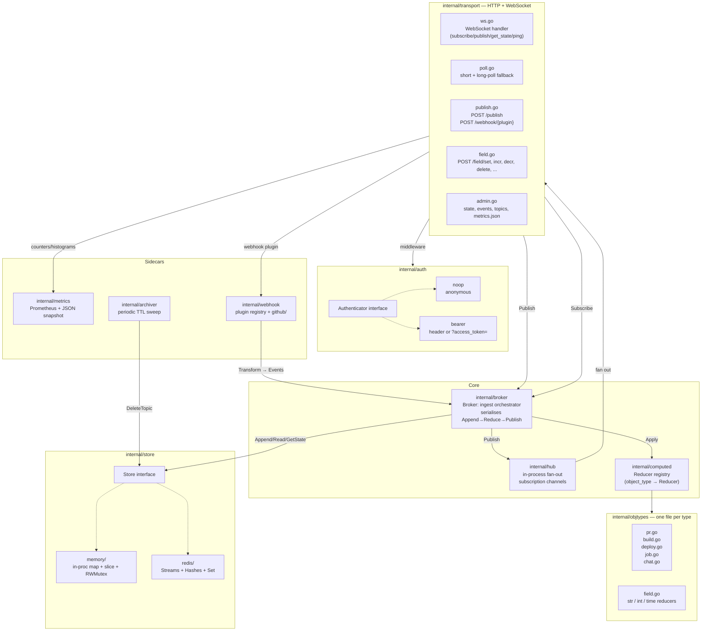
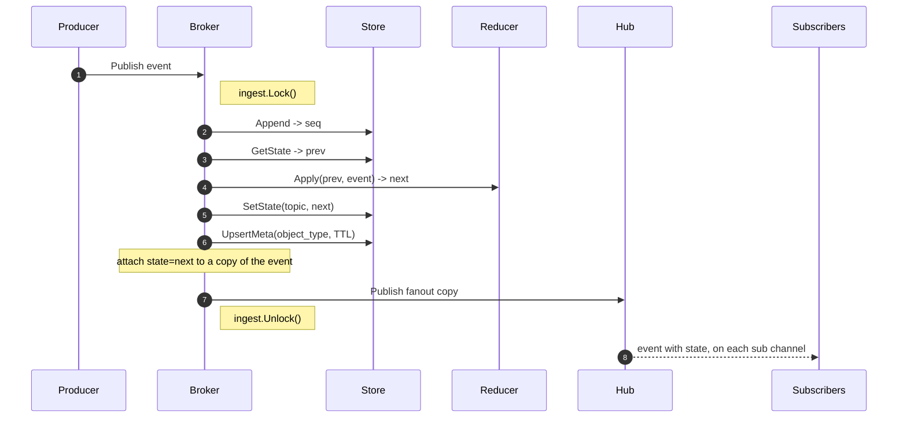
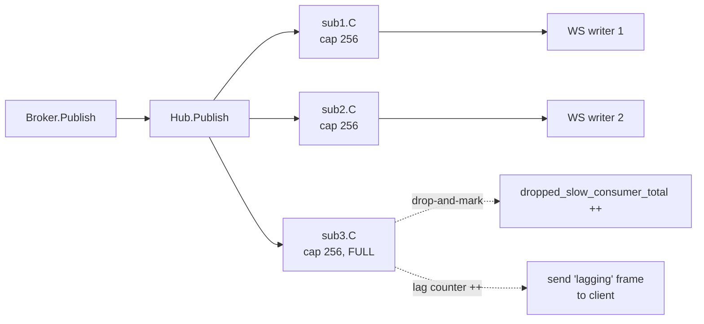
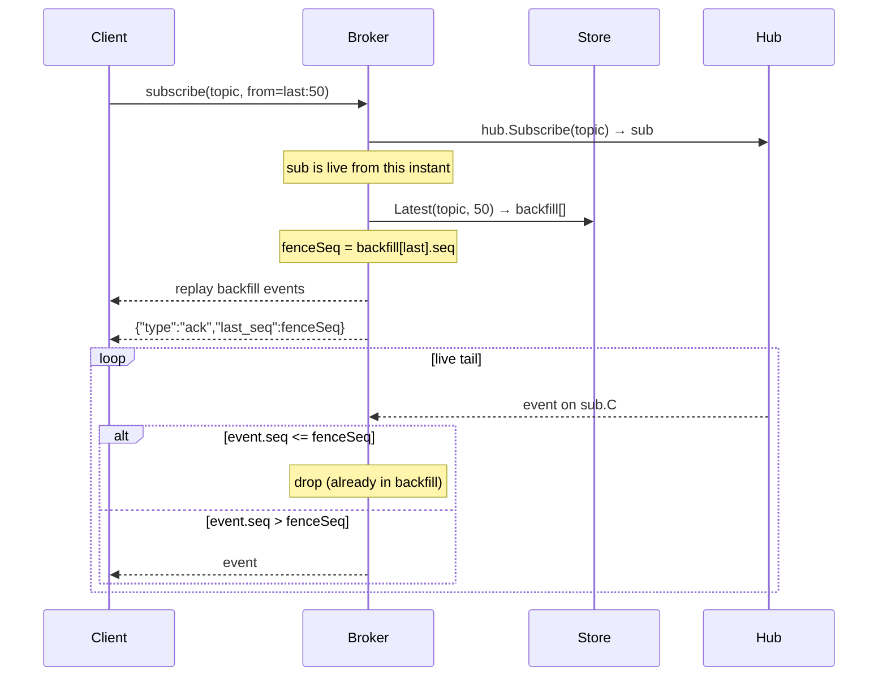
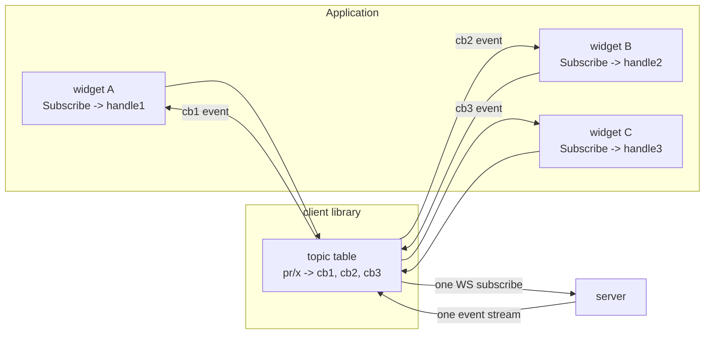
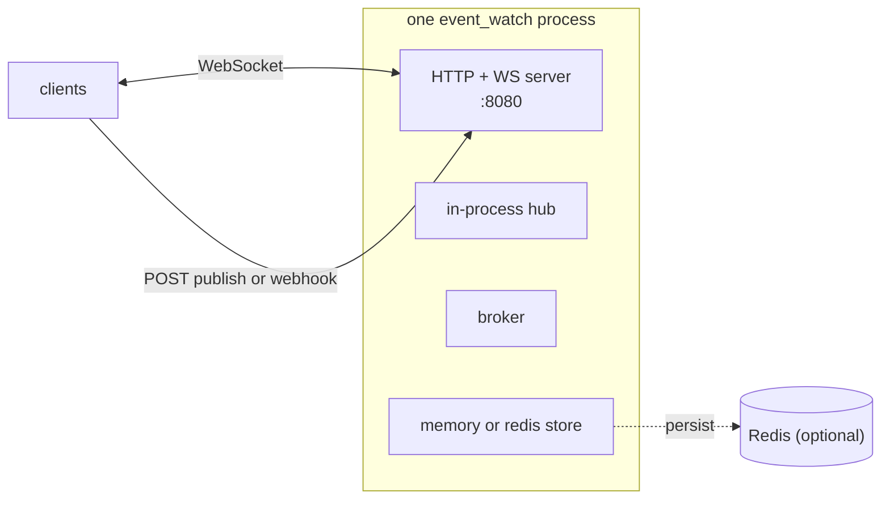
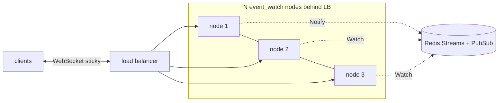

# Architecture

## Principle of operation

Everything in the system reduces to one idea:

> **Every "thing" is an append-only event stream on a named topic, and its
> "current shape" is a pure function of that stream.**

From that single sentence, the rest of the design follows mechanically:

1. **The event stream is the source of truth. State is a derived cache.**
   Publishers *append* events to a topic. A reducer folds those events into
   a snapshot. The snapshot is cheap to read but never authoritative — it
   can always be recomputed from the events. This is why historical reads
   return raw events (no `state`) and only live fan-out carries `state`.

2. **Ordering is the currency.** Every event carries a per-topic monotonic
   sequence number (`seq`). Everything else in the system — reducer
   determinism, dedup after backfill, reconnect-with-resume, atomicity of
   `int_incr` — relies on that one invariant.

3. **Serialise for correctness, fan out non-blocking for speed.** The
   ingest path (Append → Reduce → SetState → Publish-to-hub) runs under a
   single lock, so reducers see a consistent read-modify-write. Delivery
   to subscribers is best-effort per channel — one slow consumer never
   blocks another (drop-and-mark policy). This split is deliberate: the
   thing that must be linear (assigning `seq` and updating state) is
   linear; the thing that must be fast (fan-out) is lock-free.

4. **Reducers are pure and pluggable.** A reducer is just
   `(state, event) → state`. It knows nothing about storage, transport,
   auth, or how it's called. To model a new kind of object, write one
   file with one method. That's why the same server supports rich
   lifecycles (PR, deploy, build) and scalar fields (int, str, time)
   with the same core code.

5. **One wire protocol, many clients.** All producers, subscribers, UIs,
   and MCUs speak the same JSON frames over WebSocket. HTTP endpoints
   exist only as sugar for callers that can't hold a WS (services doing
   fire-and-forget publishes, webhook providers, browsers that want to
   long-poll). This is why porting the client library to a new language
   is a weekend, not a project.

6. **Storage is a swappable interface.** The `Store` interface handles
   events + state + meta. Two implementations ship (in-memory + Redis);
   both pass the same test suite. The choice is a runtime flag — the rest
   of the code never sees it.

## Structural elements

The server is a Go binary organised as a few narrowly-scoped layers.
Nothing here is clever — each piece owns one job and hands off to the
next through a small interface.

**Transport (`internal/transport`)** — HTTP + WebSocket handlers. Stateless.
Its job is to translate one wire frame into one call on the Broker, and one
outgoing event on the Hub into one wire frame back. Every handler is a
thin adapter; no business logic lives here.

**Broker (`internal/broker`)** — the ingest orchestrator, and the only
package that mutates state. Holds a per-server mutex around the four-step
ingest sequence (`Append → GetState → Apply → SetState`) so `int_incr` and
friends are atomic under any number of concurrent publishers. Also exposes
`Subscribe(topic, from)` which wires up a Hub subscription plus the
correct backfill.

**Store (`internal/store`)** — persistence. An interface with two
implementations:
- `memory/` — a `map[topic]*topicData` with an `RWMutex`. Used for tests
  and zero-dep local runs. No network, no fsync.
- `redis/` — Redis Streams for events, Hashes for meta, Strings for state,
  Sets for topic enumeration, INCR for sequence assignment. Uses a
  `TxPipeline` per Append.

**Hub (`internal/hub`)** — in-process fan-out only. Holds a registry
`topic → set of Subscriptions`. `Publish(event)` iterates subscribers and
attempts a non-blocking send to each; buffer-full drops the event and
increments the sub's `lag` counter. `Subscribe(topic) → *Subscription`
returns a channel and a `done` chan; there is no channel close (races),
just done-based cancellation.

**Reducers (`internal/objtypes` + `internal/computed`)** — a `Registry`
mapping `object_type → Reducer`. Reducers are pure: they get the previous
`json.RawMessage` state and an event, and return the new state as
`json.RawMessage`. One file per object type. The `Broker` looks up the
reducer by the topic's first segment and calls `Apply` inside the ingest
lock.

**Auth (`internal/auth`)** — `Authenticator` interface with two
implementations: `noop` (default, everyone anonymous) and `bearer` (static
token via `Authorization` header or `?access_token=` query). Wired as
standard `http.Handler` middleware. Off by default; when enabled, applies
uniformly to WS upgrade, publish, and all reads.

**Webhook plugins (`internal/webhook`)** — a `WebhookPlugin` interface
(`Verify` + `Transform`) plus a registry. Each plugin translates a
provider's raw payload into 0..N `core.Event` calls back into the Broker.
GitHub ships in v1. Adding one is a single Go file plus a line in
`server.go`.

**Metrics (`internal/metrics`)** — Prometheus registry with low-cardinality
labels (`object_type` only, never per-topic). Also exports a JSON snapshot
for the built-in UI. Counters/histograms are updated by the Transport and
the Broker.

**Archiver (`internal/archiver`)** — a background goroutine that scans
`ListTopics`, reads each `TopicMeta.TTL`, and calls `Store.DeleteTopic` for
anything past its TTL. Runs on a configurable interval (default 5m).

**Client library (`client/` and `clients/*`)** — same responsibilities
across every language, matched to that language's idioms. Owns the WS
socket, dispatches inbound events to callback registries (with
refcount-per-topic on the full-parity clients), sends outbound requests
with `req_id` for request/response, and reconnects on drop with
per-topic `from_seq=lastSeen+1` resume.

### How the pieces compose

Two data paths, no more:

**Publish** — Transport parses a frame → Broker validates topic → Broker
acquires ingest lock → Store.Append assigns seq → Broker reads prev state,
runs reducer, writes next state, upserts meta → Broker attaches `state`
to a copy of the event → Hub.Publish fans out that copy → each
subscriber's forwarder writes to its WS. All of that is one function
call per event; no queue, no goroutine handoff except at fan-out.

**Subscribe** — Transport parses the frame → Broker calls
`Hub.Subscribe(topic)` *before* reading history (so no live event is
missed during the read) → Broker fetches historical events per the
`from` option → Broker returns `(sub, backfill, fenceSeq)` → Transport
sends backfill first, then an `ack` with `last_seq=fenceSeq`, then
forwards live events from `sub.C` while dropping any with
`seq <= fenceSeq`.

Everything else — reconnect, ack, get_state, lagging frames — is a small
variation on those two.

## Core types

- **`Event`** — `{id, topic, type, seq, occurred_at, actor, payload, state?}`.
  `seq` is per-topic monotonic starting at 1. `state` is present only on
  live fan-out; historical reads return it empty.
- **`Topic`** — `<object_type>/<segment>[/<segment>...]`. Each segment
  matches `[A-Za-z0-9._-]+`, max 512 chars total. The first segment picks
  the reducer.
- **`TopicMeta`** — `{topic, object_type, ttl, created_at, last_event_at,
  last_seq}`. Written on every Append, read by the archiver.
- **Reducer** — Go interface `ObjectType() string` +
  `Apply(state json.RawMessage, e *Event) (json.RawMessage, error)`.
  Pure. Called under the Broker mutex, so the read-modify-write is atomic.
- **Subscription** — server-side: one `hub.Subscription` per WS per topic.
  Client-side: many callback registrations per topic, refcounted, all sharing
  one upstream WS subscription.

---

## Component map

With the principle and structure above in mind, here's the same picture as
boxes and arrows.



## Ingest path — single-topic ordering under concurrent publishers

Every publish (from HTTP, WS, or a webhook) hits `Broker.Publish`, which
grabs a **process-wide mutex** for the duration of one event. This is the
guarantee that makes `int_incr` atomic: no interleaving between `read state
→ apply reducer → write state`.



Design choices worth calling out:

- **Store.Append happens before reduce.** The persisted event never carries the reduced state — state is a *derived cache*, and historical reads (`Read`, `Latest`) return raw events. This keeps the stream canonical and lets you evolve reducers without rewriting history.
- **The fanned-out event is a copy** (`fanout := *e`) with `State` set. Subscribers get event + current-state in one frame; the persisted event doesn't.
- **A single ingest mutex** is fine at v1 scale. If you need higher throughput for cross-topic parallelism, shard by `hash(topic) % N` — the Broker exposes a pluggable hook for this.

## Fan-out — one hub, per-sub buffered channels, drop-and-mark



- Buffered per-subscriber channels (default 256).
- Non-blocking `select` — a slow consumer never blocks the publisher; instead the event is dropped, `sub.Lag()` increments, and a `{"type":"lagging","missed":N}` frame is delivered so the client can decide to refetch via `GetState`.
- Close is race-safe: the channel is *never* closed; instead a `done` chan is closed and publishers include a `<-done` arm in their non-blocking select.

## Subscribe backfill — seed + fence-based dedup

When you subscribe with `from=last:50` or `from_seq=X`, the server needs to
avoid duplicating events between the historical replay and the live tail.



The subscription is created **before** the backfill fetch, so no live event
is missed. The `fenceSeq` is used to dedupe against events that raced in
between.

## Client-side refcount dispatch

Every language client (except the MCU ones) implements the same idea: N
callbacks on one topic share one upstream WS subscription. Only when the
last handle closes does the client send `unsubscribe` upstream.



When `handle2.Close()` runs, the client removes `cb2`; the WS subscription
stays because `[cb1, cb3]` is still non-empty. When the last handle closes,
the client sends `{"op":"unsubscribe","topic":"pr/x"}`.

## Package structure (server side)

```
event_watch/
  cmd/
    server/                # cmd/server/main.go — flags → server.Run
    testclient/            # scriptable CLI harness
  internal/
    core/                  # Event, TopicMeta, Topic parse, SubscribeOpts
    store/
      store.go             # interface + ErrNotFound
      memory/store.go      # in-proc impl (map + slice + RWMutex)
      redis/store.go       # Redis impl (Streams + Hashes + Sets + INCR)
    hub/                   # subscriber registry + non-blocking fan-out
    computed/              # Reducer interface + Registry
    objtypes/              # one file per object type
    broker/                # ingest orchestrator (this is the "brain")
    auth/                  # Authenticator + noop + bearer + middleware
    transport/             # HTTP + WS handlers
    metrics/               # Prometheus registry + JSON snapshot
    archiver/              # background TTL sweep
    webhook/
      plugin.go            # WebhookPlugin interface + Registry
      github/              # first-party plugin
    server/                # config + Run() wire-up
  client/                  # Go client library (external-facing)
  clients/                 # non-Go client libraries
    python/  java/  rust/  esp-idf/  arduino/
  web/                     # htmx UI embedded via go:embed
  wails-client/            # native desktop app
```

## Deployment topology

### v1 (single-node)



- One server binary. All fan-out is in-process; sub-millisecond delivery.
- Store choice (memory vs redis) is a startup flag. Same interface either way.
- Restart-safe with Redis (events + state survive restarts).

### Future (multi-node)



The Store interface already has `Notify(topic, event)` and `Watch()` hook
methods — the Redis implementation doesn't use them yet, and neither does the
broker. Flipping the switch is a plumbing exercise, not a redesign.
