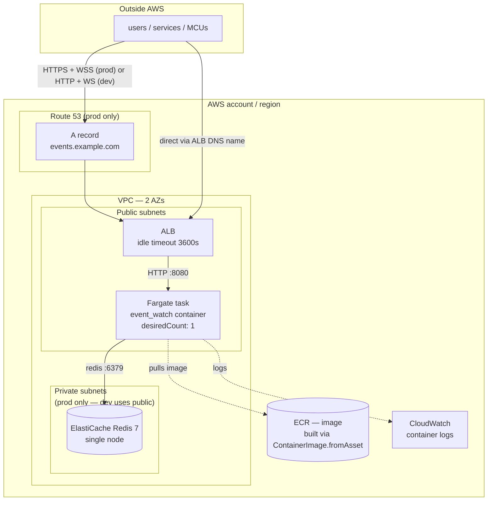

# AWS deployment (CDK)

The manifests + CDK code live in [`deploy/aws/`](../deploy/aws/); the
operational guide (commands, cost sketch, upgrade + destroy) is
[`deploy/aws/README.md`](../deploy/aws/README.md). This doc is the
conceptual view.

## What runs where



## Two stacks

**`EventWatchDev`** — smallest working shape:
- Fargate task 0.25 vCPU / 0.5 GB
- ElastiCache `cache.t4g.micro`
- Public subnets (no NAT Gateway → saves ~$32/mo)
- HTTP-only ALB on the auto-generated `*.elb.amazonaws.com` DNS name
- ~$40/mo always-on

**`EventWatchProd`** — production shape:
- Fargate task 1 vCPU / 2 GB
- ElastiCache `cache.t4g.small`
- Private subnets + NAT for tasks; ALB stays in public subnets
- HTTPS on port 443 (opt-in via `-c certificateArn=...`)
- Route 53 A record (opt-in via `-c domainName=... -c hostedZoneName=...`)
- ~$115/mo always-on

Both are the same one-file stack (`lib/event-watch-stack.ts`); the
differences are just constructor args.

## Design decisions worth calling out

### `desiredCount: 1` — for now

Same reason as the Kubernetes deployment: the server's fan-out is
in-process only, so running 2 tasks would silently split the
subscription graph (a subscriber connected to task A wouldn't see
events published through task B). The `Store` interface already
exposes `Notify` and `Watch` hooks for a Redis Pub/Sub bridge; the
broker path is designed around them. Until that ships, `desiredCount: 1`.

Rolling updates stay zero-downtime: `minHealthyPercent: 0` +
`maxHealthyPercent: 200` means CDK brings up a fresh task, waits for
health, drains the old one. WS clients auto-reconnect + resume from
`from_seq=lastSeen+1` — one reconnect per subscriber, zero missed events.

### ALB with `idleTimeout: 3600s`

The default 60s idle timeout would close every WebSocket after a minute
of silence. Bumping to 3600s (1 h) lets our heartbeat-every-30s pings
keep connections alive comfortably. Same reason the NGINX ingress
manifest carries `proxy-read-timeout: 3600` in the k8s deploy.

### Health check on `/admin/metrics.json`

Cheap (returns a JSON snapshot from the metrics registry), unauthenticated
(bypasses the auth middleware), and exercises both the HTTP server and
the metrics registry as a "process is really initialised" check.

### `ContainerImage.fromAsset` — CDK owns the image lifecycle

No separate `docker build`/`aws ecr get-login-password`/tag/push dance.
`cdk deploy` builds the image (using `deploy/Dockerfile`), hashes the
context, pushes to a CDK-managed ECR repo, and rolls the ECS service.
Content-hash tagging means unchanged code = zero-time deploy;
first-run rebuild takes ~2 min.

### Public subnets in the dev stack

NAT Gateway is ~$32/mo — a lot for a demo stack you spin up + tear down.
Dev's Fargate task gets a public IP and lives in the public subnet
alongside the ALB. Redis is still in the VPC (not publicly reachable)
because its security group only permits ingress from the task's SG.

Prod uses private subnets + one NAT so the task has no public IP.

### Redis in the VPC vs external

The stack creates its own `ElastiCache::CacheCluster` — lifecycle tied
to `cdk destroy`, cheap to spin up + tear down. For a real prod
deployment where you already have ElastiCache managed elsewhere, delete
the `Redis` construct and pass an existing endpoint via the
`EW_REDIS_ADDR` env var.

## Verify without deploying

```bash
cd deploy/aws
npm install
npx cdk synth EventWatchDev   # writes CloudFormation to cdk.out/
npx cdk synth EventWatchProd
```

Both should synth cleanly — 30 resources for dev, 40 for prod (extra
subnets + NAT for private). Templates land in
`cdk.out/EventWatch{Dev,Prod}.template.json`.

Committed placeholder `cdk.context.json` gives dummy AZs so offline
synth works. Real `cdk deploy` overrides those with your account's
actual AZ list.

## Deploy commands

```bash
# one-time bootstrap for the target account/region
npx cdk bootstrap aws://<account-id>/<region>

# dev
npx cdk deploy EventWatchDev

# prod (with HTTPS + custom domain)
npx cdk deploy EventWatchProd \
  -c certificateArn=arn:aws:acm:us-east-1:...:certificate/... \
  -c domainName=events.example.com \
  -c hostedZoneName=example.com

# tear down
npx cdk destroy EventWatchDev
```

The stack outputs a `AlbDnsName` you can immediately point clients at.
