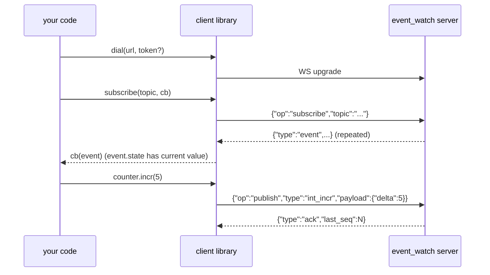

# Client usage — six languages

Every client speaks the same [wire protocol](wire-protocol.md). Same
concepts: connect → subscribe/publish/get_state → typed field helpers.

## Common pattern



## Feature parity table

| Feature | Go | Python | Java | Rust | ESP-IDF | Arduino |
|---|---|---|---|---|---|---|
| Subscribe + live events | ✅ | ✅ | ✅ | ✅ | ✅ | ✅ |
| Refcounted local dispatch | ✅ | ✅ | ✅ | ✅ | ❌ (1 cb per client) | ❌ (1 cb per client) |
| Publish request/response | ✅ | ✅ | ✅ | ✅ | ❌ (fire-and-forget) | ❌ |
| GetState via WS | ✅ | ✅ | ✅ | ✅ | ❌ (use `state` on subscribe) | ❌ |
| Auto-reconnect + resume seq | ✅ | ✅ | ✅ | ✅ | ✅ | ✅ |
| Typed field helpers | ✅ | ✅ | ✅ | ✅ | ✅ | ✅ |

---

## Go

**Location:** `client/` (top-level module — external module import path
`github.com/chris/event_watch/client`).

### Install

```bash
go get github.com/chris/event_watch/client
```

### Hello world

```go
package main

import (
    "context"
    "fmt"
    "time"

    "github.com/chris/event_watch/client"
)

func main() {
    ctx := context.Background()
    c, err := client.Dial(ctx, "ws://localhost:8080/ws")
    if err != nil { panic(err) }
    defer c.Close()

    // subscribe — refcounted; return a Handle
    h, _ := c.Subscribe(ctx, "int/counter", client.Latest(), func(e *client.Event) {
        fmt.Printf("%s seq=%d state=%s\n", e.Type, e.Seq, string(e.State))
    })
    defer h.Close()

    // typed field arithmetic
    counter := c.IntField("int/counter")
    counter.Set(ctx, 100)
    counter.Incr(ctx, 5)   // → 105
    counter.Decr(ctx, 3)   // → 102
    v, exists, _ := counter.Get(ctx)
    fmt.Println("value:", v, "exists:", exists)

    time.Sleep(300 * time.Millisecond)
}
```

### With auth

```go
c, _ := client.Dial(ctx, "ws://localhost:8080/ws",
    client.WithAuthToken("s3cr3t"))
```

### Backfill options

```go
c.Subscribe(ctx, "chat/room", client.Latest(),   cb)  // only new
c.Subscribe(ctx, "chat/room", client.LastN(50),  cb)  // last 50 + live
c.Subscribe(ctx, "chat/room", client.Seq(100),   cb)  // from seq 100 + live
```

### Test

```bash
go test -race ./client/...
```

---

## Python

**Location:** `clients/python/` (a small `pyproject.toml` package).

### Install

```bash
pip install -e clients/python
# or just: pip install websockets  and add clients/python to PYTHONPATH
```

### Hello world

```python
import asyncio
from eventwatch import Client

async def main():
    c = await Client.dial("ws://localhost:8080/ws")

    async def on_event(ev):
        print(ev.type, ev.seq, ev.state)

    h = await c.subscribe("int/counter", on_event)

    counter = c.int_field("int/counter")
    await counter.set(100)
    await counter.incr(5)      # → 105
    await counter.decr(3)      # → 102
    v, exists = await counter.get()
    print("value:", v, "exists:", exists)

    await asyncio.sleep(0.3)
    h.close()
    await c.close()

asyncio.run(main())
```

### With auth

```python
c = await Client.dial("ws://localhost:8080/ws", token="s3cr3t")
```

### Async and sync callbacks both work

```python
def sync_cb(ev): print("sync", ev.type)
async def async_cb(ev):
    await asyncio.sleep(0)   # do async work
    print("async", ev.type)

await c.subscribe("chat/x", sync_cb)
await c.subscribe("chat/x", async_cb)
```

### Test

```bash
cd clients/python
pip install -e '.[test]'
pytest -q
```

---

## Java

**Location:** `clients/java/` (Maven module, JDK 11+).

### Install

Add to your `pom.xml`:

```xml
<dependency>
  <groupId>io.eventwatch</groupId>
  <artifactId>eventwatch-client</artifactId>
  <version>0.1.0</version>
</dependency>
```

Or `mvn install` from `clients/java/` and depend on the installed local artifact.

Only third-party runtime dep is Jackson; the WebSocket layer is
`java.net.http.WebSocket` (built-in since Java 11).

### Hello world

```java
import io.eventwatch.client.*;

public class Demo {
    public static void main(String[] args) throws Exception {
        try (Client c = Client.dial("ws://localhost:8080/ws")) {

            Handle h = c.subscribe("int/counter", ev ->
                System.out.println(ev.type + " seq=" + ev.seq + " state=" + ev.state));

            IntField counter = c.intField("int/counter");
            counter.set(100);
            counter.incr(5);          // → 105
            counter.decr(3);          // → 102
            Object[] v = counter.get();  // { Long, Boolean }
            System.out.println("value=" + v[0] + " exists=" + v[1]);

            Thread.sleep(300);
            h.close();
        }
    }
}
```

### With auth

```java
Client c = Client.dial("ws://localhost:8080/ws", "s3cr3t");
```

### Test

```bash
cd clients/java
mvn test
```

---

## Rust

**Location:** `clients/rust/` (Cargo crate).

### Install

```toml
# Cargo.toml
[dependencies]
eventwatch = { path = "clients/rust" }
tokio = { version = "1", features = ["macros", "rt-multi-thread"] }
```

### Hello world

```rust
use eventwatch::Client;

#[tokio::main]
async fn main() -> Result<(), Box<dyn std::error::Error + Send + Sync>> {
    let c = Client::dial("ws://localhost:8080/ws").await?;

    let handle = c.subscribe("int/counter", "latest", |ev| {
        println!("{} seq={} state={:?}", ev.event_type, ev.seq, ev.state);
    }).await?;

    let counter = c.int_field("int/counter");
    counter.set(100).await?;
    counter.incr(5).await?;         // → 105
    counter.decr(3).await?;         // → 102
    let (v, exists) = counter.get().await?;
    println!("value={v} exists={exists}");

    tokio::time::sleep(std::time::Duration::from_millis(300)).await;
    handle.close().await;
    Ok(())
}
```

### With auth

```rust
let c = Client::dial_with_token("ws://localhost:8080/ws", "s3cr3t").await?;
```

### Test

```bash
cd clients/rust
cargo test
```

If your rustc predates 1.88, pin the icu transitives:

```bash
cargo update -p icu_normalizer  --precise 2.2.0
cargo update -p icu_properties  --precise 2.2.0
cargo update -p icu_provider    --precise 2.2.0
cargo update -p icu_locale_core --precise 2.2.0
```

---

## ESP-IDF (native ESP32)

**Location:** `clients/esp-idf/eventwatch/` (IDF component). Example project
in `clients/esp-idf/example/`.

### Install

Drop `eventwatch/` next to your other components, or point `EXTRA_COMPONENT_DIRS`
at it. The component declares its `esp_websocket_client` dep in
`idf_component.yml`; `idf.py build` fetches it into `managed_components/`.

### Hello world

```c
#include "eventwatch.h"
#include "freertos/FreeRTOS.h"
#include "freertos/task.h"

static void on_event(const char *topic, const char *type, uint64_t seq,
                     const char *payload_json, const char *state_json, void *user) {
    printf("[event] %s %s seq=%llu state=%s\n",
           topic, type, (unsigned long long)seq, state_json);
}

void app_main(void) {
    // wifi_init(); assumed elsewhere

    eventwatch_config_t cfg = {
        .url      = "ws://192.168.1.10:8080/ws",
        .event_cb = on_event,
    };
    eventwatch_client_t *c = eventwatch_start(&cfg);
    eventwatch_subscribe(c, "str/esp32/cmd", "latest");

    while (1) {
        eventwatch_int_incr(c, "int/esp32/uptime_seconds", 1);
        vTaskDelay(pdMS_TO_TICKS(1000));
    }
}
```

### API — fire-and-forget, no request/response

```c
eventwatch_int_set   (c, "int/counter", 100);
eventwatch_int_incr  (c, "int/counter",   5);
eventwatch_int_decr  (c, "int/counter",   3);
eventwatch_int_delete(c, "int/counter");

eventwatch_str_set   (c, "str/status", "ok");
eventwatch_str_delete(c, "str/status");

eventwatch_time_now  (c, "time/last_ping");

eventwatch_publish_json(c, "any/topic", "any_event", "{\"foo\":42}");
```

Read current values via `state_json` in the event callback — no separate
GetState op.

### Build

```bash
cd clients/esp-idf/example
idf.py set-target esp32
idf.py menuconfig    # set WiFi + EW_URL
idf.py build
idf.py -p /dev/tty.usbserial-XXXX flash monitor
```

### Toolchain gotcha

IDF v5.4 breaks with Homebrew CMake 4.x. Either upgrade to IDF v5.5+ or
install `cmake@3.28` and put it earlier on `PATH` before sourcing
`export.sh`.

---

## Arduino (ESP32 / ESP8266)

**Location:** `clients/arduino/eventwatch/` (Arduino library format).

### Install

1. Copy `clients/arduino/eventwatch/` into `~/Arduino/libraries/` (or symlink)
2. Install two deps in the Arduino IDE Library Manager:
   - **WebSockets** by Markus Sattler (Links2004/arduinoWebSockets)
   - **ArduinoJson** by Benoit Blanchon (v6+)

### Hello world (ESP32)

```cpp
#include <WiFi.h>
#include <EventWatch.h>

EventWatch ew;

void onEvent(const char *topic, const char *type, uint64_t seq,
             JsonVariant payload, JsonVariant state) {
    Serial.print(topic); Serial.print(" "); Serial.println(type);
    if (!state.isNull()) { serializeJson(state, Serial); Serial.println(); }
}

void setup() {
    Serial.begin(115200);
    WiFi.begin("ssid", "pass");
    while (WiFi.status() != WL_CONNECTED) delay(300);

    ew.onEvent(onEvent);
    ew.begin("192.168.1.10", 8080, "/ws");
    ew.subscribe("int/esp32/uptime_seconds", "latest");
}

unsigned long lastTick = 0;
void loop() {
    ew.loop();
    if (millis() - lastTick > 1000) {
        lastTick = millis();
        ew.intIncr("int/esp32/uptime_seconds", 1);
    }
}
```

### API

```cpp
ew.strSet   ("str/status", "ok");
ew.strDelete("str/status");

ew.intSet   ("int/counter", 100);
ew.intIncr  ("int/counter", 5);
ew.intDecr  ("int/counter", 3);
ew.intDelete("int/counter");

ew.timeNow  ("time/last_ping");

ew.publishJson("any/topic", "any_event", "{\"foo\":42}");
```

### With auth

```cpp
ew.begin("host", 8080, "/ws", "s3cr3t");
// token is appended as ?access_token=... since the Arduino WS client
// can't set headers reliably before the handshake.
```

### Complete example sketches

- `clients/arduino/eventwatch/examples/IntCounter/IntCounter.ino` — uptime counter + command subscription
- `clients/arduino/eventwatch/examples/StringSet/StringSet.ino` — publishes a status string when a sensor reading crosses a threshold

---

## Common gotchas across all clients

- **Case-sensitive topics.** `Pr/…` isn't `pr/…`. Prefer lowercase for topic segments.
- **`int_incr` needs `{"delta": N}`, not just `N`.** The reducer looks up a JSON key.
- **Field helpers exist for a reason** — they build the correct event type + payload. Use them (`intField`, `IntField`, `int_field`, `ew.intIncr(...)`) unless you have a specific reason to publish raw events.
- **`state` on a live event frame is populated only by the ingest path.** Historical reads via `/events/<topic>` return raw events without `state`. Use `/state/<topic>` for the current snapshot.
- **Reconnect is automatic** in every client. On resume, the client sends `from_seq=lastSeen+1` per topic, so you don't see duplicates or (usually) gaps.
