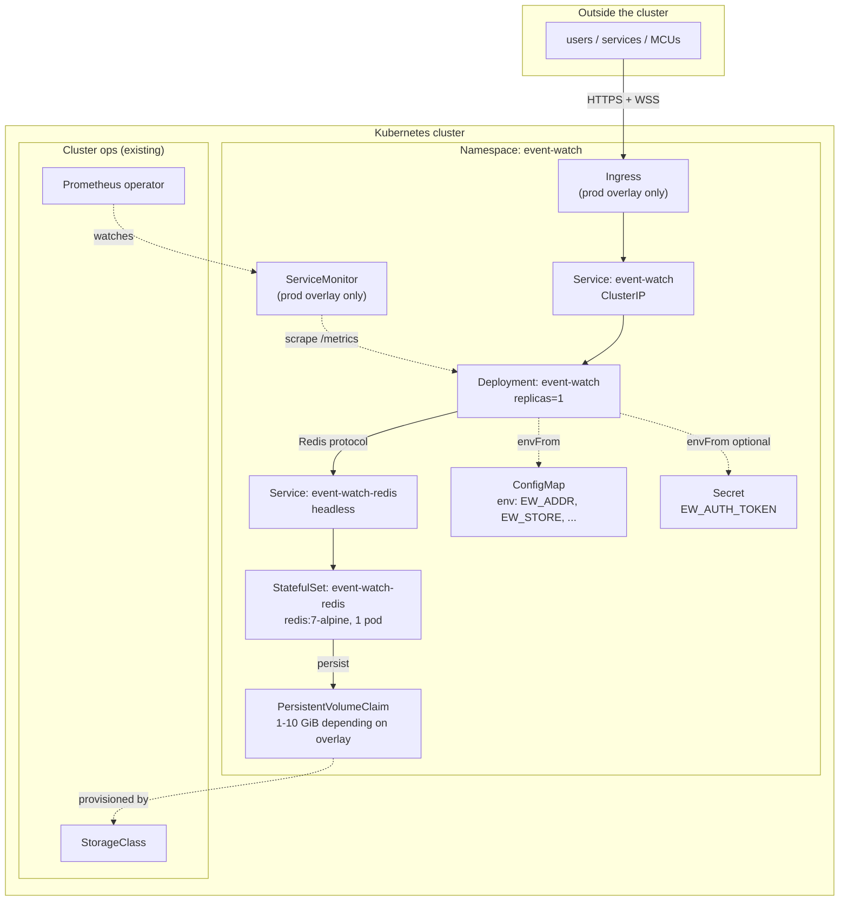

# Kubernetes deployment

Manifests + build instructions live in [`deploy/`](../deploy/). This doc
is the conceptual view; [`deploy/k8s/README.md`](../deploy/k8s/README.md)
is the operational one (commands, troubleshooting).

## What runs where



## Two overlays

**`deploy/k8s/overlays/dev`** — smallest thing that works. Redis on an
emptyDir (data lost on pod restart), one server replica, no ingress, no
ServiceMonitor. Suitable for kind/minikube/docker-desktop; deploys with
`kubectl apply -k deploy/k8s/overlays/dev`.

**`deploy/k8s/overlays/prod`** — production shape. 10 GiB PVC for Redis
via your default StorageClass, larger resource requests, NGINX Ingress
with WebSocket-friendly annotations, Prometheus ServiceMonitor for
kube-prometheus-stack. Deploys with `kubectl apply -k deploy/k8s/overlays/prod`
after you've pushed the image + created the Secret out-of-band.

## Design decisions worth calling out

### `replicas: 1` — for now

The server's fan-out is currently in-process only. A subscriber connected
to pod A won't see events published through pod B. The `Store` interface
already has `Notify(topic, event)` and `Watch()` hook methods for a Redis
Pub/Sub bridge, and the broker path is designed around them, but nothing
calls them yet. Until that ships, running >1 replica silently splits the
subscription graph. This is called out in both the Deployment YAML and the
prod overlay's `replicas:` block so no one enables horizontal scaling
without knowing.

Zero-downtime rolls still work: `strategy: RollingUpdate` with
`maxUnavailable: 0, maxSurge: 1`, and WS clients auto-reconnect with
`from_seq=lastSeen+1` on drop — so an image roll costs each subscriber
one reconnect (typically sub-second) and zero missed events.

### Redis as a StatefulSet, not a Deployment

- **Storage tied to identity.** StatefulSet + `volumeClaimTemplates` gives
  us stable per-pod PVC binding — if the pod restarts, it comes back with
  the same disk.
- **Stable DNS via the headless Service.** The pod becomes
  `event-watch-redis-0.event-watch-redis.event-watch.svc.cluster.local`.
  When we add multi-node support later, additional nodes get predictable
  names (`event-watch-redis-1`, `-2`, …).
- **`--maxmemory-policy noeviction`.** Events + reduced state are
  load-bearing; we don't want Redis silently dropping keys under memory
  pressure. Better to fail loudly.

For production HA (Redis Sentinel or Cluster), swap the StatefulSet for
the Bitnami Redis chart or the Redis Operator — the server just needs
`EW_REDIS_ADDR` to point at whatever service you end up with.

### Container image

- **Multi-stage build**: `golang:1.25-alpine` builds, `distroless/static-debian12:nonroot` runs. Final image ~15 MB, no shell.
- **Non-root** (uid 65532), `readOnlyRootFilesystem: true`, `allowPrivilegeEscalation: false`, `capabilities: drop: [ALL]`. All the standard hardening.
- **Multi-arch**: `docker buildx build --platform linux/amd64,linux/arm64` produces images for both x86 and ARM (Graviton, Ampere, M-series).

### Config surface — ConfigMap + Secret

Everything the server reads is an `EW_*` env var; the Deployment pulls
both a ConfigMap (`envFrom` for non-secret settings) and a Secret
(`envFrom optional: true` — so the pod boots without a Secret when auth
is off).

To point at an external Redis (e.g. ElastiCache/Upstash), edit the
ConfigMap's `EW_REDIS_ADDR` and delete the Redis StatefulSet+Service from
your overlay's resource list.

### Probes hit `/admin/metrics.json`

- Cheap (just returns the current metrics snapshot as JSON).
- Doesn't require auth (auth middleware skips it).
- Confirms the HTTP server is up AND the metrics registry is initialised — a good "process actually working" indicator.

## Verify without a cluster

```bash
kubectl kustomize deploy/k8s/overlays/dev  | kubectl apply --dry-run=client -f -
kubectl kustomize deploy/k8s/overlays/prod | kubectl apply --dry-run=client -f -
```

Both should apply cleanly. Prod's ServiceMonitor will `no matches for
kind` unless you have the Prometheus Operator CRDs installed — remove
`servicemonitor.yaml` from `deploy/k8s/extras/kustomization.yaml` if you
don't run kube-prometheus-stack.
