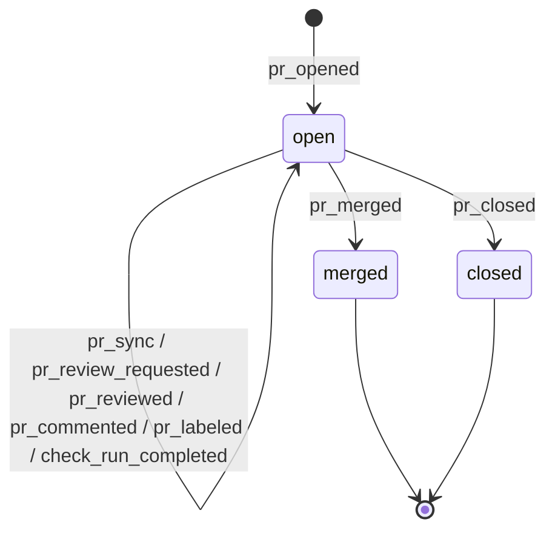

# Object types

Eight built-in types in v1, split into **event-object types** (rich reduced
state) and **scalar-field types** (single value). Every type registers a
reducer in `internal/objtypes/`; the topic's first segment picks the reducer.

## At a glance

| Type | Topic pattern | Purpose |
|---|---|---|
| `pr` | `pr/<owner>/<repo>/<num>` | GitHub PR lifecycle |
| `build` | `build/<pipeline>/<run>` | CI build with per-step timings |
| `deploy` | `deploy/<env>/<service>` | deployment with versions + health |
| `job` | `job/<uuid>` | long-running job with progress + log tail |
| `chat` | `chat/<room>` | chat room with participants + recent messages |
| `str` | `str/<name>` | scalar string field |
| `int` | `int/<name>` | scalar int field with atomic incr/decr |
| `time` | `time/<name>` | scalar timestamp field |

---

## Event-object types

These have rich state — a nested struct that's the "current shape" of the
tracked object.

### `pr` — GitHub pull request

**Topic:** `pr/<owner>/<repo>/<number>`

**Events:**
| Type | Payload | Effect on state |
|---|---|---|
| `pr_opened` | `{title, author, base, head}` | set title/author/base/head, state=open |
| `pr_sync` | `{head}` | update head sha (new push) |
| `pr_review_requested` | `{reviewer}` | append to reviewers[] |
| `pr_reviewed` | `{state:"approved"|"changes_requested"}` | increment approvals / changes_requested counter |
| `pr_commented` | `{}` | comments++ |
| `pr_labeled` | `{label}` | append to labels[] |
| `pr_unlabeled` | `{label}` | remove from labels[] |
| `pr_merged` | `{}` | state=merged, set merged_at |
| `pr_closed` | `{}` | state=closed (unless already merged) |
| `check_run_completed` | `{conclusion, name}` | checks.{passed,failed,pending}++ |

**Computed state (PRState):**
```json
{
  "title": "Add feature",
  "author": "alice",
  "base": "main",
  "head": "abc123",
  "state": "merged",
  "reviewers": ["bob"],
  "approvals": 1,
  "changes_requested": 0,
  "labels": ["enhancement"],
  "checks": {"passed": 3, "failed": 0, "pending": 0},
  "comments": 2,
  "merged_at": "2026-08-31T22:07:44Z",
  "updated_at": "2026-08-31T22:07:44Z"
}
```

**Lifecycle:**


### `build` — CI build

**Topic:** `build/<pipeline>/<run>`

**Events:**
| Type | Payload | Effect |
|---|---|---|
| `build_queued` | — | status=queued |
| `build_started` | — | status=running, started_at=now |
| `step_started` | `{step}` | append step (status=running), currentStep=name |
| `step_finished` | `{step, status?}` | mark step done, compute duration_ms |
| `build_finished` | `{status?}` | status=success\|failed, finished_at=now, total duration_ms |

**Computed state (BuildState):**
```json
{
  "status": "success",
  "current_step": "",
  "steps": [
    {"name": "compile", "status": "success", "duration_ms": 340},
    {"name": "test", "status": "success", "duration_ms": 1250}
  ],
  "started_at": "...",
  "finished_at": "...",
  "duration_ms": 1610
}
```

### `deploy` — deployment with health

**Topic:** `deploy/<env>/<service>`

**Events:**
| Type | Payload | Effect |
|---|---|---|
| `deploy_started` | `{version, env?, service?}` | previous_version←current_version, current_version←new, in_progress=true |
| `health_check_pass` | — | health=healthy |
| `health_check_fail` | — | health=degraded or down |
| `rollback` | `{to?}` | swap current↔previous (or set to `to`), in_progress=false |
| `deploy_finished` | `{status?}` | in_progress=false, last_success_at if success |

**Computed state (DeployState):**
```json
{
  "env": "prod",
  "service": "api",
  "current_version": "v42",
  "previous_version": "v41",
  "health": "healthy",
  "in_progress": false,
  "last_deploy_at": "...",
  "last_success_at": "..."
}
```

### `job` — long-running job

**Topic:** `job/<uuid>` (or any unique id)

**Events:**
| Type | Payload | Effect |
|---|---|---|
| `job_started` | `{name?}` | status=running, started_at=now |
| `job_progress` | `{percent?, eta_seconds?}` | update percent / ETA |
| `job_log` | `{line}` | append to logs[] (capped at 50) |
| `job_finished` | — | status=succeeded, percent=100 |
| `job_failed` | — | status=failed |

**Computed state (JobState):**
```json
{
  "name": "reindex",
  "percent": 100,
  "eta_seconds": 0,
  "status": "succeeded",
  "logs": [{"at": "...", "line": "processing shard 3"}],
  "started_at": "...",
  "finished_at": "..."
}
```

### `chat` — chat room

**Topic:** `chat/<room>`

**Events:**
| Type | Payload | Effect |
|---|---|---|
| `user_joined` | `{user}` | append to participants[] (unique) |
| `user_left` | `{user}` | remove from participants[] |
| `msg_posted` | `{id, user, text}` | append to recent[] (capped at 50) |
| `msg_edited` | `{id, text}` | update matching msg, mark edited |
| `msg_deleted` | `{id}` | remove matching msg from recent[] |

**Computed state (ChatState):**
```json
{
  "room": "general",
  "participants": ["alice", "bob"],
  "recent": [
    {"id": "m1", "user": "alice", "text": "hey team", "posted_at": "..."},
    {"id": "m2", "user": "bob", "text": "hi", "posted_at": "..."}
  ]
}
```

---

## Scalar-field types

These have a single primitive value + `exists` flag. Every mutation is an
event; subscribers get the mutation + the new value.

### `str` — string field

**Topic:** `str/<name>` (e.g. `str/status`, `str/config/theme`)

**Events:**
| Type | Payload | Effect |
|---|---|---|
| `str_set` | `{value}` | value=payload.value, exists=true |
| `str_delete` | — | value="", exists=false |

**State:** `{value: "alice", exists: true, updated_at: "..."}`

### `int` — integer field

**Topic:** `int/<name>` (e.g. `int/counter`, `int/hits/homepage`)

**Events:**
| Type | Payload | Effect |
|---|---|---|
| `int_set` | `{value}` | value=payload.value |
| `int_incr` | `{delta?}` | value+=delta (default +1); if unset, treats as 0 |
| `int_decr` | `{delta?}` | value-=delta (default -1) |
| `int_delete` | — | value=0, exists=false |

**State:** `{value: 102, exists: true, updated_at: "..."}`

**Atomicity:** the broker serialises ingest, so N concurrent `int_incr(+1)`
calls from any mix of clients/languages produce exactly `value=N`. See
`internal/broker/field_atomic_test.go` (500 concurrent goroutines).

### `time` — timestamp field

**Topic:** `time/<name>` (e.g. `time/last_seen`, `time/next_run/backup`)

**Events:**
| Type | Payload | Effect |
|---|---|---|
| `time_set` | `{value:"RFC3339"}` | parse + store |
| `time_now` | — | value=event.OccurredAt (server-side; no client-clock skew) |
| `time_add` | `{seconds}` | value += seconds (may be negative) |
| `time_delete` | — | value=zero, exists=false |

**State:** `{value: "2026-08-31T22:07:44Z", exists: true, updated_at: "..."}`

---

## Choosing the right type

- **Event-object** when you have a real-world entity with a lifecycle (pipeline runs, deployments, PRs, orders, tickets…). One topic = one entity. Reducer captures the model.
- **Scalar-field** when you have a metric, flag, or knob (hit counter, current theme, last-heartbeat time, feature-flag boolean expressed as `str`). One topic = one value. Subscribers watch for changes.
- Not sure? Start with a scalar field; promote to an event-object when the shape grows to more than a couple of related values.
