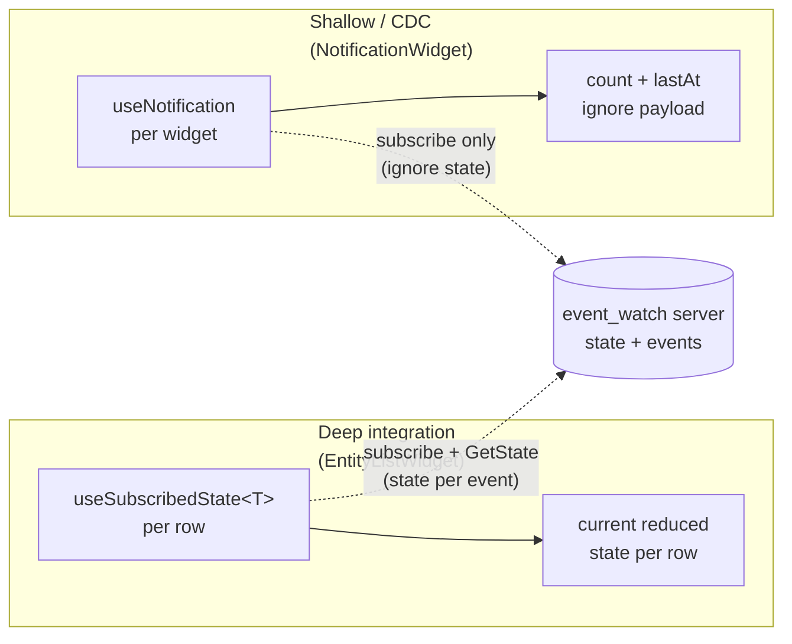

# React app + UI integration patterns

The React app in [`clients/react/`](../clients/react/) is a full-parity
demo of the Wails desktop app — same four operational cards (Connect,
Subscribe, Publish, Fields) plus:

- Two integration-pattern widgets:
  1. **Entity list** — deep integration. One subscription per rendered
     item; each item renders its own reduced state.
  2. **Notification** — shallow / change-data-capture. Ignores payload;
     just knows that *something* happened.
- A **Cheatsheet card** — every event type + payload example from
  [`docs/cheatsheet.md`](cheatsheet.md), each with an "Inject →" button
  that fills the Publish card so you never need to type an event name
  or payload by hand.
- Small **ⓘ** hover-hints on the Publish card's Topic / Event type /
  Payload inputs pointing you at the format rules.

Both integrations run on the same [`@eventwatch/browser`](../clients/browser/)
client library and demonstrate the two custom hooks that make React
integration a one-liner.

## The two patterns



## When to use which

| You want to… | Use |
|---|---|
| Render the current shape of an entity (a PR row, a job progress bar, a deployment tile) and keep it live | `useSubscribedState<T>(topic)` |
| Refetch data from another API when something changes | `useNotification(topic)` |
| Invalidate a query cache (react-query / SWR / Apollo) | `useNotification` — call `queryClient.invalidateQueries` inside your effect |
| Bounce a UI element when an event fires | `useNotification` — flash a class / play a sound |
| Show progress of a long-running task | `useSubscribedState<JobState>` — read `state.percent`, `state.logs` |
| Build a "N unread" badge | `useNotification` — count events, reset on click |

The deep pattern is heavier per topic (one Client subscription plus one
GetState round-trip on mount) but gives you strongly-typed data directly.
The shallow pattern is the same subscription minus the state processing —
identical wire cost, just less client work.

## Custom hook implementations

Both hooks are ~15 lines and live at
[`clients/react/src/hooks/`](../clients/react/src/hooks/):

```ts
// useSubscribedState — for the entity list
export function useSubscribedState<T>(topic: string | null): T | null {
  const { client } = useClient();
  const [state, setState] = useState<T | null>(null);
  useEffect(() => {
    if (!client || !topic) { setState(null); return; }
    let cancelled = false;
    client.getState(topic).then((s) => { if (!cancelled) setState(s as T | null); });
    const handle = client.subscribe(topic, (ev) => {
      if (ev.state !== undefined) setState(ev.state as T);
    });
    return () => { cancelled = true; handle.close(); };
  }, [client, topic]);
  return state;
}

// useNotification — for the CDC widget
export function useNotification(topic: string | null): Notification {
  const { client } = useClient();
  const [n, setN] = useState<Notification>({ count: 0, lastAt: null, lastEventType: '' });
  useEffect(() => {
    if (!client || !topic) return;
    const handle = client.subscribe(topic, (ev) => {
      setN((prev) => ({ count: prev.count + 1, lastAt: Date.now(), lastEventType: ev.type }));
    });
    return () => handle.close();
  }, [client, topic]);
  return n;
}
```

That's the whole integration surface. Refcounted subscribe on the Client
means N components can subscribe to the same topic and share one upstream
subscription automatically — no coordination needed.

## Demo scripts

See [`clients/react/README.md`](../clients/react/README.md) for
step-by-step demo scripts for both widgets. Short version:

- **Entity list:** add a `pr/octo/hello/1` row; run the PR simulate button
  in another tab; watch the row populate + update.
- **Notification:** watch `chat/notifications`; publish anything on that
  topic; watch the panel pulse.

## Parity with the Wails app

The same two widgets are also present in the Wails desktop app (added at
the bottom of the card grid). Same demo scripts work against either UI —
the underlying `client/` Go library and the `@eventwatch/browser` JS
library speak the identical wire protocol.

Pick the UI you prefer:

| | Wails | React |
|---|---|---|
| Runtime | native webview + Go | any modern browser |
| Distribution | packaged `.app` / `.exe` | static files behind any web server |
| Bundle size | ~20 MB app package | ~52 kB gzipped JS |
| Language | vanilla JS bound to Go via `wails generate module` | TypeScript with types from `@eventwatch/browser` |
| Live reload during dev | `wails dev` (Vite + Go rebuild watcher) | `vite dev` (JS only) |
